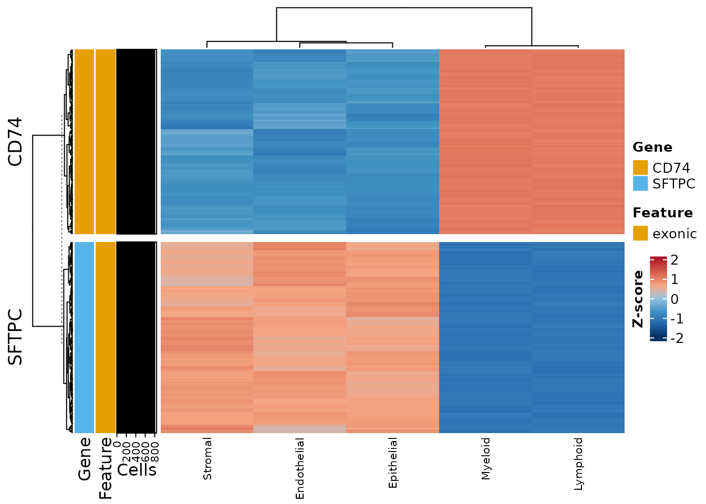

# Cell-level DE SNP Analysis

``` r

library(variantCell)
```

## What `findDESNPs()` actually measures

Read this before using it.

[`findDESNPs()`](https://github.com/cchmc/variantCell/reference/findDESNPs.md)
compares **read depth at a variant position** between cell groups. Depth
at a position is the abundance of the transcript containing it — so this
is an expression test, not a genotype test. Germline genotype is fixed
within an individual and cannot differ between that individual’s cell
types.

The measurement is real and correctly computed. The question is whether
it is the best available instrument, and mostly it is not. Measured on
52,809 cells of a lung transplant cohort against the matched gene count
matrix:

|  |  |
|----|----|
| reads captured at SNP positions | **51.3%** of the gene matrix |
| expressed genes with no covered SNP | **40.3%** |
| median gene: reads retained | 20% (well-covered genes up to 90%) |
| median gene: SNPs carried | **13** |
| correction burden | ~739,000 sites vs ~20,000 genes = **37× stricter** |

The coverage is not thin — half of all reads land at SNP positions. The
problem is arithmetic: per test you hold roughly 1.5% of a gene’s
evidence while paying 37 times the multiple-testing penalty, on 60% of
the genes. **Seurat’s `FindMarkers()` on the gene count matrix strictly
dominates this for “which genes differ between these cell groups.”**

Use
[`findDESNPs()`](https://github.com/cchmc/variantCell/reference/findDESNPs.md)
for:

- **A specific gene you already care about.** The multiple-testing
  argument largely evaporates once you are not scanning.
- **The coverage companion to
  [`findSNPsByGroup()`](https://github.com/cchmc/variantCell/reference/findSNPsByGroup.md)**
  — confirming depth was adequate in the group where a variant was
  called absent, since otherwise “absent” only means “not detected”.
- **Checking coverage comparability** before comparing allele fractions,
  since differential depth creates differential power.

## Setup

``` r

sim <- simulateVariantCellData(verbose = FALSE)
inf <- inferDonorType(sim$metadata, vireo_dir = sim$vireo_dir, verbose = FALSE)

project <- variantCell$new()
for (s in sim$design$sample) {
  project$addSampleData(
    sample_id    = s,
    vireo_path   = sim$vireo_paths[[s]],
    cellsnp_path = sim$cellsnp_paths[[s]],
    cell_data    = sim$metadata[sim$metadata$Biopsy == s, ],
    data_type    = "dataframe",
    prefix_text  = sim$prefixes[[s]],
    donor_type   = inf$donor_types[[s]]
  )
}
project$buildSNPDatabase()
project$setProjectIdentity("compartment")
```

``` r

table(project$snp_database$cell_metadata$compartment)
#> 
#> Endothelial  Epithelial    Lymphoid     Myeloid     Stromal 
#>          68         229         265         175          63
```

The simulator gave each gene a known depth difference between immune and
structural cells, so there is a right answer to compare against.

## Running the test

``` r

res <- project$findDESNPs(
  ident.1 = "Myeloid",
  ident.2 = "Epithelial",
  n_cores = 2
)
```

[`findDESNPs()`](https://github.com/cchmc/variantCell/reference/findDESNPs.md)
returns a **list**, not a data frame:

``` r

names(res)
#> [1] "results" "summary"
de <- res$results
dim(de)
#> [1] 1663   22
```

``` r

colnames(de)
#>  [1] "snp_idx"         "chromosome"      "position"        "ref"            
#>  [5] "alt"             "feature_type"    "gene_name"       "gene_type"      
#>  [9] "log2fc"          "avg_expr_group1" "avg_expr_group2" "total_cells_1"  
#> [13] "total_cells_2"   "expr_cells_1"    "expr_cells_2"    "expr_frac_1"    
#> [17] "expr_frac_2"     "mean_alt_frac_1" "mean_alt_frac_2" "pvalue"         
#> [21] "padj"            "percent_change"
```

Note the column names: `log2fc`, `pvalue`, `padj` — not the Seurat
spellings.

``` r

top <- head(de[order(de$padj, -abs(de$log2fc)),
               c("gene_name", "position", "log2fc", "padj",
                 "expr_frac_1", "expr_frac_2")], 8)
top
#>                 gene_name  position    log2fc          padj expr_frac_1
#> 9_134909428_C_A      FCN1 134909428 0.6810829 4.568681e-300   0.7828571
#> 9_134908470_G_C      FCN1 134908470 0.6734167 4.568681e-300   0.9657143
#> 9_134906576_A_G      FCN1 134906576 0.6626048 4.568681e-300   0.1885714
#> 9_134909577_G_C      FCN1 134909577 0.6517470 4.568681e-300   0.2571429
#> 9_134908492_T_C      FCN1 134908492 0.6499112 4.568681e-300   0.9085714
#> 9_134907449_G_C      FCN1 134907449 0.6493934 4.568681e-300   0.4857143
#> 9_134909386_T_G      FCN1 134909386 0.6449355 4.568681e-300   0.4000000
#> 9_134907342_C_T      FCN1 134907342 0.6405497 4.568681e-300   0.7657143
#>                 expr_frac_2
#> 9_134909428_C_A   0.4716157
#> 9_134908470_G_C   0.4235808
#> 9_134906576_A_G   0.1135371
#> 9_134909577_G_C   0.3187773
#> 9_134908492_T_C   0.4192140
#> 9_134907449_G_C   0.1135371
#> 9_134909386_T_G   0.2401747
#> 9_134907342_C_T   0.4148472
```

## Does it recover the truth?

Aggregate to the gene level and compare against the depth shift the
simulator built in:

``` r

obs <- tapply(de$log2fc, de$gene_name, median, na.rm = TRUE)
truth <- sim$sites$immune_log2[match(names(obs), sim$sites$gene)]
cmp <- data.frame(gene = names(obs),
                  observed = round(as.numeric(obs), 2),
                  simulated = truth)
cmp <- cmp[!is.na(cmp$simulated), ]
cmp[order(cmp$simulated), ]
#>       gene observed simulated
#> 12   SFTPC    -1.01      -2.5
#> 11 SCGB1A1    -0.87      -2.0
#> 2    CLDN5    -0.70      -1.8
#> 4      DCN    -0.70      -1.6
#> 9   PECAM1    -0.64      -1.4
#> 14     VIM    -0.21       0.0
#> 7     JAK1    -0.16       0.2
#> 6     IFI6    -0.13       0.4
#> 8    MARCO     0.37       1.4
#> 5     FCN1     0.55       2.0
#> 1     CD74     0.52       2.2
```

``` r

round(cor(cmp$observed, cmp$simulated), 3)
#> [1] 0.995
```

The ordering is recovered almost exactly. Two things are worth noticing.

**The magnitudes are compressed.** With `use_normalized = TRUE` (the
default), depth is size-factor normalised and `log1p`-transformed, so a
fold change on that scale is much smaller than the underlying count
ratio. Treat `log2fc` as an ordering, not as a count ratio.

**A truly null gene does not come back at zero.** `VIM` was simulated
with no difference at all, yet reads as mildly depleted in myeloid
cells. That is compositional normalisation working correctly: immune
cells carry far more `CD74`, `FCN1` and `VCAN` reads, which inflates
their size factors and pushes everything else down. The same effect
exists in ordinary RNA-seq. It is a reason to be careful with small
effects, not a bug.

**Almost everything is significant:**

``` r

sprintf("%d of %d sites at padj < 0.05", sum(de$padj < 0.05, na.rm = TRUE), nrow(de))
#> [1] "1609 of 1663 sites at padj < 0.05"
```

That is what testing across ~800 individual cells buys you. Cells within
a library share a genome, a capture and a sequencing run, so they are
not independent observations; treating them as such inflates
significance. This is the standard single-cell DE pseudoreplication
problem and it is the deeper reason not to read this output as a
discovery scan. When the unit of observation matters, aggregate to the
sample —
[`computeAlleleFractionIndex()`](https://github.com/cchmc/variantCell/reference/computeAlleleFractionIndex.md)
and
[`findDEAlleleFraction()`](https://github.com/cchmc/variantCell/reference/findDEAlleleFraction.md)
do exactly that.

## The legitimate use: one gene you already care about

``` r

cd74 <- de[de$gene_name == "CD74", ]
sprintf("CD74: %d sites, median log2fc %.2f, %d significant",
        nrow(cd74), median(cd74$log2fc, na.rm = TRUE),
        sum(cd74$padj < 0.05, na.rm = TRUE))
#> [1] "CD74: 173 sites, median log2fc 0.52, 173 significant"
```

Here you are not scanning, the gene is well covered, and the
multiple-testing objection does not apply.

## Useful arguments

``` r

project$findDESNPs(
  ident.1         = "Myeloid",
  ident.2         = NULL,      # NULL compares against all other cells
  donor_type      = "Donor",   # restrict to one genome
  use_normalized  = TRUE,      # size-factor normalised depth
  min_expr_cells  = 3,         # sites must be seen in this many cells
  min_alt_frac    = 0.2,       # ...at this alt fraction, to be testable
  logfc.threshold = 0.1,
  p.adjust.method = "BH",
  n_cores         = 4
)
```

`min_alt_frac` and `min_expr_cells` decide which sites are **testable**.
They do not decide which cells contribute to the effect size — that runs
over all cells in the group, following the Seurat convention, so the
fold change and the p-value describe the same population.

Alt fractions are always computed from raw AD/DP regardless of
`use_normalized`, since there is no normalised AD matrix and dividing a
raw count by a log-scaled depth does not produce a fraction.

## Visualising SNPs across cell groups

``` r

project$plotSNPHeatmap(
  genes         = c("CD74", "SFTPC"),
  group.by      = "compartment",
  min_alt_frac  = 0,
  show_rownames = FALSE   # hundreds of sites; labels are unreadable
)
#> Warning: rs# identifiers requested but not available in project. Using chromosome:position format instead.
#> 
#> rs# identifiers requested but not available. Using chromosome:position format.
```



Immune compartments carry the `CD74` sites and structural compartments
the `SFTPC` sites, which is the depth difference the simulation built
in.

To get the underlying matrix instead of the plot:

``` r

hm <- project$plotSNPHeatmap(
  genes        = c("CD74"),
  group.by     = "compartment",
  min_alt_frac = 0,
  data_out     = TRUE
)
#> Warning: rs# identifiers requested but not available in project. Using chromosome:position format instead.
str(hm, max.level = 1)
#> List of 5
#>  $ raw_matrix      : num [1:174, 1:5] 1.89 1.71 1.98 1.8 1.94 ...
#>   ..- attr(*, "dimnames")=List of 2
#>  $ scaled_matrix   : num [1:174, 1:5] -0.608 -0.955 -0.774 -0.961 -0.622 ...
#>   ..- attr(*, "scaled:center")= Named num [1:174] 2.31 2.34 2.43 2.4 2.35 ...
#>   .. ..- attr(*, "names")= chr [1:174] "5_150401642_G_T" "5_150401652_T_G" "5_150401662_A_C" "5_150401672_G_A" ...
#>   ..- attr(*, "scaled:scale")= Named num [1:174] 0.696 0.662 0.577 0.628 0.664 ...
#>   .. ..- attr(*, "names")= chr [1:174] "5_150401642_G_T" "5_150401652_T_G" "5_150401662_A_C" "5_150401672_G_A" ...
#>   ..- attr(*, "dimnames")=List of 2
#>  $ cell_counts     : num [1:174, 1:5] 229 229 229 229 229 229 229 229 229 229 ...
#>   ..- attr(*, "dimnames")=List of 2
#>  $ expr_cell_counts: num [1:174, 1:5] 229 229 229 229 229 229 229 229 229 229 ...
#>   ..- attr(*, "dimnames")=List of 2
#>  $ snp_info        :'data.frame':    174 obs. of  8 variables:
```

## Extracting cells by SNP status

[`getCellsForSNPs()`](https://github.com/cchmc/variantCell/reference/getCellsForSNPs.md)
returns cell IDs meeting an allele-fraction and depth criterion, which
is how you annotate a Seurat object with variant status:

Three identifier forms are accepted: the full `CHROM_POS_REF_ALT` key,
an rs ID if you annotated against a reference VCF, and plain
`chromosome:position`.

``` r

info <- project$snp_database$snp_info
# pick the best-covered site in the database
best <- which.max(Matrix::rowSums(project$snp_database$dp_matrix))
target <- paste(info$CHROM[best], info$POS[best], sep = ":")

carriers <- project$getCellsForSNPs(
  snp_ids      = target,
  min_alt_frac = 0.2,
  min_dp       = 3
)
```

``` r

attr(carriers, "summary")
#>        snp_id snp_found total_cells_with_data cells_meeting_criteria
#> 1 5:150401915      TRUE                   715                    148
#>   mean_alt_frac  mean_dp
#> 1     0.1223425 5.262937
head(carriers[[1]], 3)
#> [1] "S1_GGGCGGGTGAACTGCT-1" "S1_TTACGTCTACAGCATG-1" "S1_CGGAGCAGCTTTAGAG-1"
```

Those cell IDs are ready to annotate an external object:

``` r

seurat_obj$snp_status <- ifelse(colnames(seurat_obj) %in% carriers[[1]],
                                "carrier", "non-carrier")
```

The summary distinguishes cells with *any* reads at the site from cells
that passed both thresholds, which is the difference between “not
carrying it” and “not covered”.

## Next

- **Group-level DE SNP analysis** —
  [`findSNPsByGroup()`](https://github.com/cchmc/variantCell/reference/findSNPsByGroup.md)
  and the genotype guard.
- **Building the SNP database** — the import path.
