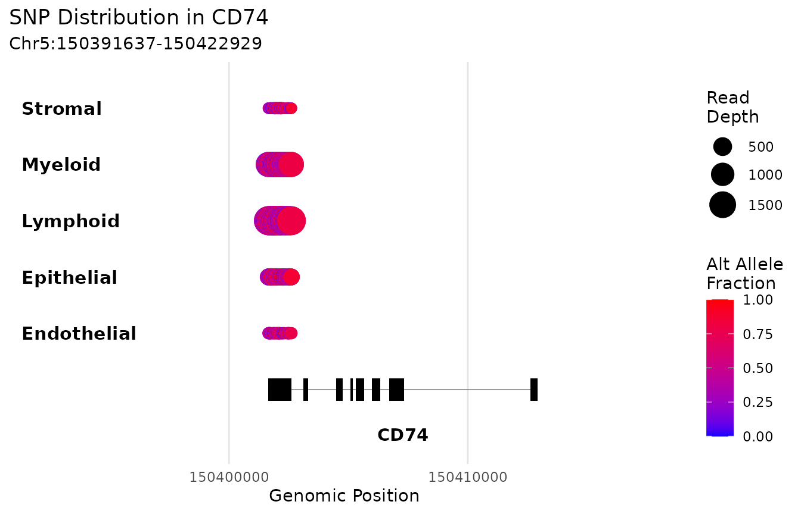
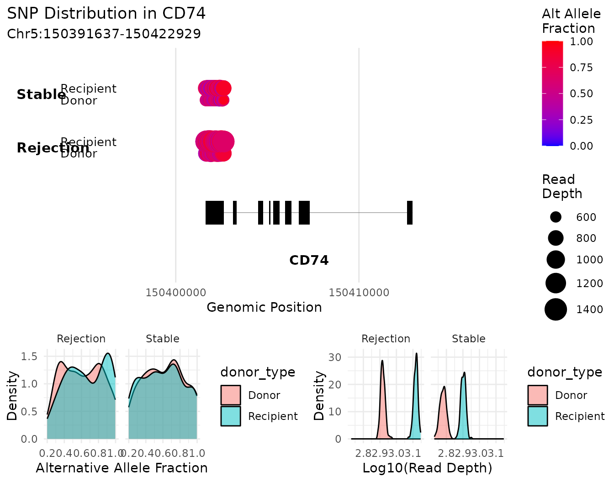

# Group-level DE SNP Analysis

``` r

library(variantCell)
```

## Presence and absence is a genotype test

[`findSNPsByGroup()`](https://github.com/cchmc/variantCell/reference/findSNPsByGroup.md)
asks which variants are present in one group of cells and absent in
another. Because germline genotype is fixed at conception, that question
is only meaningful when the two groups are **different genomes**.

There are three regimes, and nothing in a cell-identity label tells you
which one you are in:

| your two groups are | status |
|----|----|
| two genomes, one on each side, in one library | **valid**, and strong |
| the same genome | **structurally empty** — not underpowered, empty |
| several genomes on each side | a **genetic association** design, capped by group size |

[`checkGenotypeConcordance()`](https://github.com/cchmc/variantCell/reference/checkGenotypeConcordance.md)
measures which regime applies, directly from the data.
[`findSNPsByGroup()`](https://github.com/cchmc/variantCell/reference/findSNPsByGroup.md)
runs it by default and warns.

## Setup

``` r

sim <- simulateVariantCellData(verbose = FALSE)
inf <- inferDonorType(sim$metadata, vireo_dir = sim$vireo_dir, verbose = FALSE)

project <- variantCell$new()
for (s in sim$design$sample) {
  project$addSampleData(
    sample_id    = s,
    vireo_path   = sim$vireo_paths[[s]],
    cellsnp_path = sim$cellsnp_paths[[s]],
    cell_data    = sim$metadata[sim$metadata$Biopsy == s, ],
    data_type    = "dataframe",
    prefix_text  = sim$prefixes[[s]],
    donor_type   = inf$donor_types[[s]]
  )
}
project$buildSNPDatabase()
```

``` r

sim$design
#>   sample patient condition
#> 1     S1      P1 Rejection
#> 2     S2      P1 Rejection
#> 3     S3      P2 Rejection
#> 4     S4      P3    Stable
#> 5     S5      P4    Stable
```

Note that `S1` and `S2` are repeat biopsies of the same patient. That
gives us one of each regime to demonstrate.

## Measuring the regime before testing

``` r

db <- project$snp_database
cm <- db$cell_metadata

regime <- function(label, i1, i2, ...) {
  r <- checkGenotypeConcordance(db, i1, i2, verbose = FALSE, ...)
  data.frame(contrast = label,
             concordance = round(r$concordance, 3),
             genomes = paste(r$n_genomes1, "vs", r$n_genomes2),
             verdict = r$verdict)
}

rbind(
  regime("S1 Donor vs S1 Recipient",
         which(cm$sample_id == "S1" & cm$donor_type == "Donor"),
         which(cm$sample_id == "S1" & cm$donor_type == "Recipient")),
  regime("S1 vs S2 Recipient (same patient)",
         which(cm$sample_id == "S1" & cm$donor_type == "Recipient"),
         which(cm$sample_id == "S2" & cm$donor_type == "Recipient")),
  regime("all Donor vs all Recipient",
         which(cm$donor_type == "Donor"),
         which(cm$donor_type == "Recipient"),
         split_by = cm$sample_id),
  regime("Rejection vs Stable patients",
         which(cm$condition == "Rejection"),
         which(cm$condition == "Stable"),
         split_by = cm$patient)
)
#>                            contrast concordance genomes              verdict
#> 1          S1 Donor vs S1 Recipient       0.499  1 vs 1    different_genomes
#> 2 S1 vs S2 Recipient (same patient)       0.999  1 vs 1          same_genome
#> 3        all Donor vs all Recipient       0.689  4 vs 4 heterogeneous_groups
#> 4      Rejection vs Stable patients       0.653  2 vs 2 heterogeneous_groups
```

Two genomes in one library agree at about half of callable sites. The
same person sampled twice agrees at essentially all of them. Both pooled
contrasts are flagged `heterogeneous_groups`, because each side contains
several unrelated individuals.

## Aggregating

[`findSNPsByGroup()`](https://github.com/cchmc/variantCell/reference/findSNPsByGroup.md)
works on aggregated counts, not on cells. There are two modes.

**Sample-stratified** (the default) keeps samples separate within each
group, so a variant has to be consistent across samples rather than
driven by one:

``` r

agg <- project$aggregateByGroup(group_by = "condition")
```

``` r

agg$mode
#> [1] "sample_stratified"
agg$metadata
#>               group n_cells n_samples filter_status
#> Rejection Rejection     480         3      included
#> Stable       Stable     320         2      included
```

**Group-only** pools every cell in the group. Set
`sample_column = NULL`:

``` r

agg_pooled <- project$aggregateByGroup(group_by = "condition",
                                       sample_column = NULL)
```

``` r

agg_pooled$mode
#> [1] "group_only"
```

Use sample-stratified for anything crossing samples. Group-only pools
across individuals, and in the real cohort its within-group concordance
(0.52) was *lower* than the between-group value (0.723) — the groups
were less internally consistent than they were different from each
other.

Other useful arguments:

``` r

project$aggregateByGroup(
  group_by            = "condition",
  sample_column       = "sample_id",
  donor_type          = "Donor",   # restrict to one genome
  min_cells_per_group = 3,
  use_normalized      = TRUE
)
```

## The valid contrast: two genomes in one library

Subset to a single sample, then split on genotype:

``` r

s1 <- project$subsetVariantCell(column = "sample_id", values = "S1")
agg_s1 <- s1$aggregateByGroup(group_by = "donor_type")
res_s1 <- s1$findSNPsByGroup(
  ident.1 = "Donor",
  ident.2 = "Recipient",
  aggregated_data = agg_s1
)
```

``` r

res_s1$genotype_check$verdict
#> [1] "different_genomes"
c(sites_tested = res_s1$summary$total_tested,
  sites_passing = res_s1$summary$passed_filters)
#>  sites_tested sites_passing 
#>          1994           564
table(res_s1$results$presence)
#> 
#>     Present in Donor Present in Recipient 
#>                  283                  281
```

Hundreds of variants are present in one genome and absent in the other.
This is the regime the function is for, and the answer is a genotype
call rather than a statistical claim — with one library per side there
is no sample-level replication to compute a p-value from. Rank on
`presence_score`:

``` r

top <- head(res_s1$results[order(-res_s1$results$presence_score),
                           c("chromosome", "position", "gene_name",
                             "alt_frac_1", "alt_frac_2", "presence",
                             "presence_score")], 6)
top
#>     chromosome  position gene_name alt_frac_1 alt_frac_2             presence
#> 86           2 118942221     MARCO 0.02000000  0.9785714 Present in Recipient
#> 87           2 118942231     MARCO 0.00000000  0.9855072 Present in Recipient
#> 88           2 118942292     MARCO 0.00000000  1.0000000 Present in Recipient
#> 97           2 118944910     MARCO 0.02325581  0.5312500 Present in Recipient
#> 100          2 118970170     MARCO 0.00000000  0.5230769 Present in Recipient
#> 101          2 118970201     MARCO 0.00000000  0.5129870 Present in Recipient
#>     presence_score
#> 86       0.9748193
#> 87       0.9748193
#> 88       0.9748193
#> 97       0.9748193
#> 100      0.9748193
#> 101      0.9748193
```

## The capped contrast: patients against patients

``` r

res_cond <- withCallingHandlers(
  project$findSNPsByGroup(ident.1 = "Rejection", ident.2 = "Stable",
                          aggregated_data = agg),
  warning = function(w) invokeRestart("muffleWarning")
)
```

The guard travels with the result, so a flagged contrast is still
recognisable when the object is read back months later:

``` r

g <- res_cond$genotype_check
data.frame(
  verdict              = g$verdict,
  genomes              = paste(g$n_genomes1, "vs", g$n_genomes2),
  min_attainable_p     = signif(g$min_attainable_p, 3),
  bonferroni_threshold = signif(g$bonferroni_threshold, 3),
  reachable            = g$significance_reachable
)
#>                verdict genomes min_attainable_p bonferroni_threshold reachable
#> 1 heterogeneous_groups  2 vs 2            0.333             2.51e-05     FALSE
```

``` r

res_cond$summary$significant_results
#> [1] 0
```

Zero, and no amount of extra sequencing changes that.

Note that the guard reports **2 vs 2**, not the three-against-two you
might expect from the sample counts. The independent unit is the
individual, not the library — `S1` and `S2` are the same patient, so
they contribute one genome between them. The count comes from clustering
on genotype concordance rather than from any patient column, so it
cannot be inflated by a mislabelled sample.

With two individuals against two, the smallest two-sided p a **perfectly
separating** variant can produce is `2 / choose(4, 2)` = 0.333, against
a Bonferroni threshold of roughly 2.5e-5. The ceiling depends only on
the group sizes:

``` r

ceiling_p <- function(n1, n2) 2 / choose(n1 + n2, n1)
data.frame(
  individuals = c("2 vs 2", "5 vs 4", "10 vs 10", "14 vs 14"),
  best_attainable_p = signif(c(ceiling_p(2, 2), ceiling_p(5, 4),
                               ceiling_p(10, 10), ceiling_p(14, 14)), 3)
)
#>   individuals best_attainable_p
#> 1      2 vs 2          3.33e-01
#> 2      5 vs 4          1.59e-02
#> 3    10 vs 10          1.08e-05
#> 4    14 vs 14          4.99e-08
```

Against ~2,000 sites here — or ~739,000 in a real database — you need on
the order of fourteen versus fourteen individuals before a perfect
separator clears correction at all, and real association studies run to
hundreds because nothing separates perfectly.

This design is not *invalid*; it is a case-control genetic association
study, which is a real thing. It simply cannot reach significance at
this n, so **rank hits as exploratory candidates rather than
thresholding them**. Two caveats survive at any n and ranking does not
fix either: unrelated individuals differ in ancestry, which shifts
allele frequencies genome-wide independently of your grouping variable;
and if your groups differ in 10x chemistry, the two arms interrogate
different variant space.

## The empty contrast

``` r

p1 <- project$subsetVariantCell(column = "patient", values = "P1")
agg_p1 <- p1$aggregateByGroup(group_by = "sample_id")
```

``` r

cm1 <- p1$snp_database$cell_metadata
gc <- checkGenotypeConcordance(
  p1$snp_database,
  which(cm1$sample_id == "S1"),
  which(cm1$sample_id == "S2"),
  verbose = FALSE
)
c(concordance = round(gc$concordance, 3), verdict = gc$verdict)
#>   concordance       verdict 
#>       "0.947" "same_genome"
```

`same_genome`. One person’s germline genotype does not change between
biopsies, so there is nothing here to find and any apparent hit is
transcript abundance or coverage. If that is what you want to test, use
[`findDESNPs()`](https://github.com/cchmc/variantCell/reference/findDESNPs.md)
— or better, ordinary gene-level differential expression.

## Reading the results

``` r

colnames(res_s1$results)
#>  [1] "snp_idx"               "chromosome"            "position"             
#>  [4] "ref"                   "alt"                   "feature_type"         
#>  [7] "gene_name"             "gene_type"             "depth_1"              
#> [10] "depth_2"               "alt_count_1"           "alt_count_2"          
#> [13] "alt_frac_1"            "alt_frac_2"            "alt_frac_diff"        
#> [16] "n_samples_1"           "n_samples_2"           "samples_present_1"    
#> [19] "samples_present_2"     "samples_absent_1"      "samples_absent_2"     
#> [22] "pct_samples_present_1" "pct_samples_present_2" "sample_consistency"   
#> [25] "presence_score"        "presence"              "p_value"              
#> [28] "effect_size"           "depth_cv"              "alt_frac_consistency" 
#> [31] "sample_coverage"       "overall_quality"       "p_adjusted"           
#> [34] "significant"
```

The columns worth knowing:

- `alt_frac_1` / `alt_frac_2` — alternative allele fraction in each
  group.
- `presence` — which group the variant was called present in.
- `presence_score` — composite of alt-fraction difference, sample
  consistency and coverage. This is the ranking statistic.
- `sample_consistency` — fraction of samples in the group agreeing.
  Meaningless when a group has one sample.
- `p_value` / `p_adjusted` / `significant` — only interpretable when the
  design can actually reach significance. Check `genotype_check` first.
- `depth_1` / `depth_2` — summed depth. Note this is `rowSums` **across
  samples**, so `min_depth = 10` over eleven samples is a weak
  per-sample guarantee.

``` r

write.csv(res_s1$results, "SNPs_donor_vs_recipient_S1.csv", row.names = FALSE)
```

## Visualising SNPs in a gene

``` r

project$plotSNPs(
  "CD74",
  group.by     = "compartment",
  min_alt_frac = 0,
  plot_density = FALSE
)
#> Loading required package: ggplot2
#> Loading required package: cowplot
#> Warning: rs# identifiers requested but not available in project. Use buildSNPDatabase(add_rs_ids = TRUE, VCF_file_path = '...') to add them.
#> Warning: Population AF requested but not available in project. Use buildSNPDatabase(add_population_AF = TRUE, VCF_file_path = '...') to add them.
#> 
#> Retrieving gene coordinates for CD74...
#> Processing SNP data for gene CD74...
#> Processing group 1/5: Endothelial
#> Processing group 2/5: Epithelial
#> Processing group 3/5: Lymphoid
#> Processing group 4/5: Myeloid
#> Processing group 5/5: Stromal
#> 
#> Plotting Summary:
#> Total SNPs: 174
#> Feature types:
#> exonic 
#>    870
```



Point position is genomic coordinate, colour is alternative allele
fraction, and size is read depth.

Split within each group to compare genotypes side by side:

``` r

project$plotSNPs(
  "CD74",
  group.by     = "condition",
  split.by     = "donor_type",
  min_alt_frac = 0.2,
  plot_density = TRUE
)
#> Warning: rs# identifiers requested but not available in project. Use buildSNPDatabase(add_rs_ids = TRUE, VCF_file_path = '...') to add them.
#> Warning: Population AF requested but not available in project. Use buildSNPDatabase(add_population_AF = TRUE, VCF_file_path = '...') to add them.
#> 
#> Retrieving gene coordinates for CD74...
#> Processing SNP data for gene CD74...
#> Processing group 1/2: Rejection
#> Creating data frame with: 139 valid SNPs
#>  - alt_fractions length: 139
#>  - depth_filtered length: 139
#> Creating data frame with: 132 valid SNPs
#>  - alt_fractions length: 132
#>  - depth_filtered length: 132
#> Processing group 2/2: Stable
#> Creating data frame with: 146 valid SNPs
#>  - alt_fractions length: 146
#>  - depth_filtered length: 146
#> Creating data frame with: 151 valid SNPs
#>  - alt_fractions length: 151
#>  - depth_filtered length: 151
#> 
#> Plotting Summary:
#> Total SNPs: 169
#> Feature types:
#> exonic 
#>    568
#> Warning: `aes_string()` was deprecated in ggplot2 3.0.0.
#> ℹ Please use tidy evaluation idioms with `aes()`.
#> ℹ See also `vignette("ggplot2-in-packages")` for more information.
#> ℹ The deprecated feature was likely used in the variantCell package.
#>   Please report the issue at <https://github.com/cchmc/variantCell/issues>.
#> This warning is displayed once per session.
#> Call `lifecycle::last_lifecycle_warnings()` to see where this warning was
#> generated.
```



Or take the underlying data frame instead of the plot:

``` r

jak1 <- project$plotSNPs(
  "JAK1",
  group.by     = "compartment",
  min_alt_frac = 0,
  data_out     = TRUE
)
#> Warning: rs# identifiers requested but not available in project. Use buildSNPDatabase(add_rs_ids = TRUE, VCF_file_path = '...') to add them.
#> Warning: Population AF requested but not available in project. Use buildSNPDatabase(add_population_AF = TRUE, VCF_file_path = '...') to add them.
#> 
#> Retrieving gene coordinates for JAK1...
#> Processing SNP data for gene JAK1...
#> Processing group 1/5: Endothelial
#> Processing group 2/5: Epithelial
#> Processing group 3/5: Lymphoid
#> Processing group 4/5: Myeloid
#> Processing group 5/5: Stromal
#> 
#> Plotting Summary:
#> Total SNPs: 180
#> Feature types:
#> exonic 
#>    900 
#> 
#> rs# identifiers requested but not available. Use buildSNPDatabase(add_rs_ids = TRUE, VCF_file_path = '...') to add them.
#> Population AF requested but not available. Use buildSNPDatabase(add_population_AF = TRUE, VCF_file_path = '...') to add them.
head(jak1, 4)
#>         group split snp_idx chromosome position ref alt feature_type gene_name
#> 1 Endothelial    NA     164          1 64833234   C   G       exonic      JAK1
#> 2 Endothelial    NA     165          1 64833244   A   T       exonic      JAK1
#> 3 Endothelial    NA     166          1 64833254   G   A       exonic      JAK1
#> 4 Endothelial    NA     167          1 64833264   C   G       exonic      JAK1
#>        gene_type depth alt_fraction n_cells
#> 1 protein_coding    45   0.97777778      34
#> 2 protein_coding    45   0.02222222      37
#> 3 protein_coding    41   0.41463415      28
#> 4 protein_coding    41   0.36585366      35
```

[`plotSNPs()`](https://github.com/cchmc/variantCell/reference/plotSNPs.md)
looks the gene up in `EnsDb.Hsapiens.v86`, so it needs a symbol that
resolves to exactly one record. Genes with alternative-haplotype or
readthrough entries — `HLA-A`, `B2M`, `PTPRC` — return several and will
not plot.

## Testing allele fraction instead

If your question is about the *fraction* of reads carrying the
alternative base rather than presence or absence — RNA editing rate,
allele-specific expression, mitochondrial heteroplasmy — that is a
different statistic, and `R/09-allele-fraction.R` provides it. The unit
of observation is the sample, not the cell:

``` r

idx <- project$computeAlleleFractionIndex(group_by = "donor_type")
#> Aggregating 1994 sites over 10 pseudobulks...
#> Returned 10 pseudobulks across 5 sample_id units.
#> Paired test over 5 units floors at p = 0.0625.
head(idx, 4)
#>   split group n_cells n_sites total_ad total_dp     index
#> 1    S1 Donor      72    1994    67691   134814 0.5021066
#> 2    S2 Donor      72    1993    69884   138887 0.5031716
#> 3    S3 Donor      70    1994    67003   129535 0.5172579
#> 4    S4 Donor      72    1992    72198   136979 0.5270735
```

One index per pseudobulk means one statistic, so there is no genome-wide
correction to pay — which is why it works at cohort sizes where a
per-site scan cannot.
[`findDEAlleleFraction()`](https://github.com/cchmc/variantCell/reference/findDEAlleleFraction.md)
tests sites individually and reports the same attainable-p ceiling
before you commit to it.

## Next

- **Cell-level DE SNP analysis** —
  [`findDESNPs()`](https://github.com/cchmc/variantCell/reference/findDESNPs.md),
  and why it is not a discovery scan.
- **Determining donor and recipient cells** — getting the genotype
  labels right in the first place.
